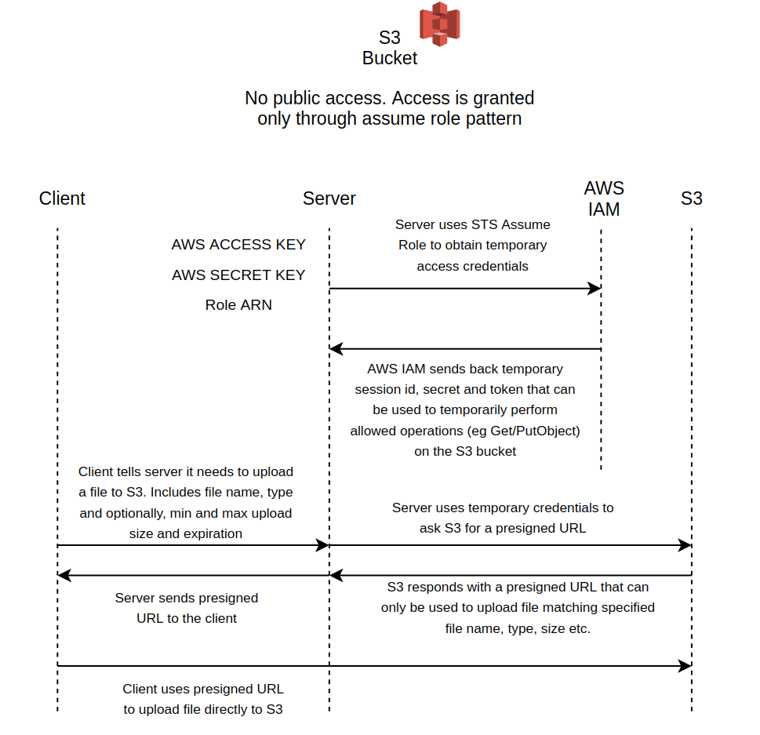

This project shows how to implement a server that can return back a presigned URL that can be used (eg., by a client) to upload a file to S3. The main advantage of this design is that AWS credentials needed to access S3 are not exposed to the client. Malicious uploads are prevented by the signing mechanism, which ensures that only a client file matching the requested file name, type and size range can be uploaded and the presigned URL is valid only for a limited amount of time. 



Following standard S3 access best practices, I have disabled public access to my S3 bucket. The bucket can only be accessed by assuming an IAM role which has a Bucket access policy attached. This policy permits Get/Put/List operations on the S3 bucket. The ```get_session_creds.sh``` script reads the IAM role ARN from iamroles.txt and obtains the AWS access key/secret using AWS configure for a specified user profile. Then, it uses STS Assume Role to obtain temporary (but long lived - 12 hrs) credentials (access key, secret and token) which are stored in awsenv.list in the root project directory. The server reads this file at startup and uses the temporary credentials to make Boto calls. The iamroles.txt and awsenv.list files are not included in this repo. Create these files with your own access credentials. If you unfamiliar with these concepts, I recommend reading about IAM, specifically the assume role pattern in AWS docs. 

The server implementation uses Flask MethodViews and Marshmallow for request parsing and validation. See implementation in resources/signed_url.py for return codes and tests for example usage.

## Installation and Usage
- ```git clone``` this repo to a directory of your choice and cd to that directory
- Create a awsenv.list file. This file should contain ACCESS, SECRET and TOKEN key=value pairs that can be used to make Boto calls. If you are using the AssumeRole pattern, you can use the ```get_session_creds.sh``` script to generate this file. The inputs are the IAMRole ARN, the S3 bucket name and your AWS profile access key and secret. Modify the script according to your needs. 
- Edit bff_api/config.py to add your S3 bucket name and AWS region
- In a command window, run ```pip install . ``` This will use setup.py to create and install a Python package. Alternatively, you can create a separate conda environment first to avoid polluting your base environment
- Run ```python test_app_conda_env.py ``` . This imports the bff_api package you just created and runs the server on localhost at port 5001
- Install pytest and run ```pytest -v tests``` from the root directory. Going through the tests also shows how to use the returned signed_url to post a file to S3

I have also included a tox file (tox.ini) to run tests, flake8 and pylint for linting and code style enforcement. This will create a new environment, install the package and run tests and linting in that environment. Note that for the tests to succeed, you must have the server already running. 

